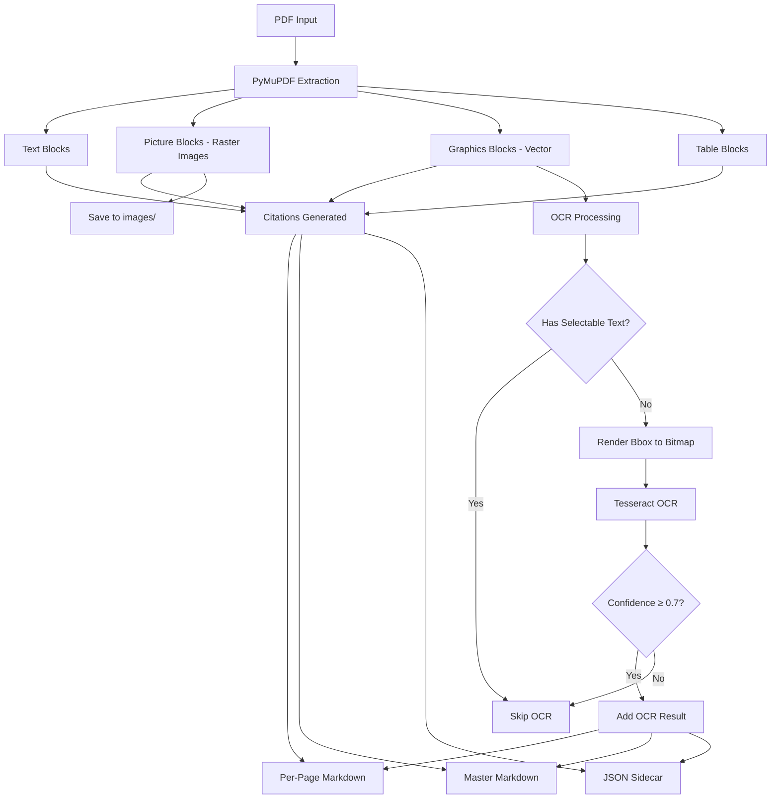

# Phase 2: Data Workflow Documentation

## Overview

Phase 2 extracts content from POCT1 PDF specifications using PyMuPDF4LLM with **mandatory provenance tracking** (citations for every extracted element).

## Output Structure

Each processing run creates a timestamped output directory:

```
data/spec_output/YYYYMMDD_HHMMSS_<identifier>/
├── images/           # Extracted raster images (PNG/JPEG from PDF)
├── markdown/         # Human-readable markdown output
│   ├── *_MASTER.md  # 1:1 complete document (all pages combined)
│   ├── page_1.md    # Per-page markdown (for reference)
│   ├── page_2.md
│   └── ...
├── json/            # Machine-readable JSON with full metadata
│   └── <pdf_name>.json
└── index/           # Search indices (Phase 3 - not yet implemented)
```

## Content Types Extracted

PyMuPDF distinguishes between:

### 1. **Text Blocks**
- Selectable text from PDF (fonts, unicode, layout)
- Example: Body paragraphs, headers, field descriptions
- **Source:** `text`

### 2. **Picture Blocks** (Raster Images)
- Embedded PNG/JPEG/TIFF images in PDF
- Saved to `images/` directory as `page{N}_img{idx}.png`
- Example: Scanned diagrams, photos, rasterized graphics
- **Source:** `ocr` (if OCR is performed on the image)
- **Note:** Many PDFs have ZERO raster images (all vector graphics)

### 3. **Graphics Blocks** (Vector Graphics)
- SVG-like vector drawings (logos, lines, borders, shapes)
- **NOT saved as image files** by default (only bboxes extracted)
- Example: Company logos, decorative lines, page borders, chart lines
- **Source:** `graphics`
- OCR is attempted on graphics blocks to detect embedded text

### 4. **Table Blocks**
- Detected tables converted to markdown format
- Includes structure (rows, columns, headers)
- **Source:** `text`

## Why is `images/` Empty?

**Short answer:** Your PDF has **0 raster images**, only **vector graphics**.

**Explanation:**
- PDFs can contain two types of visual elements:
  1. **Raster images** (PNG/JPEG) → saved to `images/`
  2. **Vector graphics** (logos, lines, SVG-like) → only bboxes extracted, not rendered
  
- The test PDF (POCT1 spec) has:
  - Page 1: **48 graphics blocks** (Roche/LIAT logo components, borders)
  - Page 2: **2 graphics blocks** (copyright symbol, decorative elements)
  - **0 picture blocks** (no embedded raster images)

- OCR is attempted on graphics blocks to detect text, but most return 0% confidence (decorative elements with no actual text)

## Markdown Output Files

### `*_MASTER.md` (Primary Output)

**Purpose:** 1:1 representation of complete PDF document

**Structure:**
```markdown
# <pdf_name>

**Total Pages:** N

---

## Page 1

<page 1 content from PyMuPDF>

---

## Page 2

<page 2 content from PyMuPDF>

---

## Master Citation Index

### Page 1
[^p1_txt1]: Page 1, bbox [x0, y0, x1, y1], source: text
[^p1_gfx3]: Page 1, bbox [x0, y0, x1, y1], source: graphics
...

### Page 2
[^p2_txt1]: Page 2, bbox [x0, y0, x1, y1], source: text
...
```

**Features:**
- All pages combined in reading order
- Complete citation index at end (grouped by page)
- OCR results embedded near source content (if confidence ≥ 0.7)
- Full provenance: every element traceable to exact page + bbox

### `page_N.md` (Per-Page Reference Files)

**Purpose:** Individual page files for quick reference

**Structure:**
```markdown
<page content from PyMuPDF>

---

## Citations

[^p1_txt1]: Page 1, bbox [x0, y0, x1, y1], source: text
[^p1_gfx3]: Page 1, bbox [x0, y0, x1, y1], source: graphics
...
```

**Use cases:**
- Quick page lookup without loading full document
- Page-specific citation reference
- Debugging individual page extraction

## JSON Sidecar (Machine-Readable)

**File:** `json/<pdf_name>.json`

**Purpose:** Complete structured data with full metadata for machine processing

**Structure:**
```json
{
  "pdf_name": "document-name",
  "total_pages": 236,
  "pages": [
    {
      "page": 1,
      "markdown": "<raw PyMuPDF markdown>",
      "blocks": [
        {
          "type": "text|picture|table|graphics",
          "bbox": [x0, y0, x1, y1],
          "citation": "p1_txt1",
          "content": "<extracted text>",
          "md_slice": [start, end],
          "source": "text|ocr|graphics"
        }
      ],
      "ocr": [
        {
          "text": "<OCR extracted text>",
          "confidence": 0.87,
          "bbox": [x0, y0, x1, y1],
          "citation": "p1_ocr1",
          "associated_block": "p1_gfx3"
        }
      ],
      "citations": {
        "p1_txt1": {
          "page": 1,
          "bbox": [x0, y0, x1, y1],
          "source": "text",
          "content_type": "text"
        }
      },
      "metadata": {
        "width": 612.0,
        "height": 792.0
      }
    }
  ]
}
```

**Features:**
- Deterministic, parseable format
- Complete provenance for every element
- OCR results with confidence scores
- Easy to diff/version control
- Direct citation → source mapping

## Citation Format

Every extracted element has a unique citation ID:

**Format:** `p{page}_{type}{index}`

**Examples:**
- `p1_txt1` - Page 1, Text block #1
- `p12_img3` - Page 12, Image #3
- `p5_gfx7` - Page 5, Graphics block #7
- `p2_ocr1` - Page 2, OCR result #1

**Citation Data:**
```python
{
    "page": 12,                    # Page number (1-indexed)
    "bbox": [100.5, 200.0, 500.0, 400.0],  # [x0, y0, x1, y1] coordinates
    "source": "text|ocr|graphics",  # How content was extracted
    "content_type": "text|picture|table|graphics",  # Block type
    "file_reference": "page12_img3.png"  # (optional) if saved to images/
}
```

## OCR Processing

**When OCR is performed:**
- Picture blocks (embedded raster images)
- Graphics blocks (vector graphics that might contain text)

**OCR Workflow:**
1. **Text-check:** Check if bbox already has selectable text
   - If YES → skip OCR (avoid duplication)
   - If NO → proceed with OCR
2. **Render region:** Convert bbox to high-DPI bitmap (300 DPI)
3. **Run Tesseract:** Extract text with confidence scoring
4. **Filter results:** Only keep results with confidence ≥ 0.7 (default threshold)
5. **Attach provenance:** Add citation, bbox, confidence to OCR result

**Why most graphics return 0% confidence:**
- Graphics blocks are often decorative (logos, lines, borders)
- No actual text to extract
- 0% confidence is expected and correct behavior

**Bbox clipping:**
- Graphics can have bboxes extending beyond page boundaries (full-bleed designs)
- Pipeline automatically clips bboxes to page dimensions before OCR rendering
- No errors, graceful handling of edge cases

## Workflow Summary



## Understanding Your Output

For the POCT1 test PDF (2 pages):

### Extracted Content:
- **Page 1:** 50 blocks (2 text, 0 images, 0 tables, 48 graphics)
- **Page 2:** 5 blocks (3 text, 0 images, 0 tables, 2 graphics)
- **Total:** 55 blocks

### Why `images/` is empty:
- 0 raster images (picture blocks)
- All visual elements are vector graphics (logos, borders)

### OCR Results:
- 48 graphics OCR candidates on page 1
- 2 graphics OCR candidates on page 2
- 0 OCR results above confidence threshold (0.7)
- **Expected:** Graphics are decorative (Roche/LIAT logo components, borders, lines)

### Markdown Output:
- **Master:** 5106 characters (complete document, both pages + citations)
- **Page 1:** 4371 characters (title page content + 48 graphic citations)
- **Page 2:** 608 characters (copyright info + 2 graphic citations)

### JSON Output:
- Complete structured data with all 55 blocks
- Full provenance (page, bbox, source) for every element
- Machine-readable, ready for Phase 3 entity extraction

## What's Next: Phase 3

`index/` directory will be populated in Phase 3 with:
- **FAISS vector indices** (semantic search)
- **BM25 keyword indices** (text search)
- **Entity graphs** (POCT1 messages, fields, XML schemas)
- **Embedding models** (all-MiniLM-L6-v2, CPU-only)

Phase 3 will use the RLM DocumentNavigator to surgically extract entity context with full provenance.

## Questions & Answers

### Q: Why don't I see any images in `images/`?
**A:** Your PDF contains only vector graphics (logos, lines), not raster images (PNG/JPEG). Vector graphics are extracted as bboxes, not saved as image files.

### Q: Should graphics be rendered and saved as images?
**A:** Not by default. Most graphics are decorative elements without useful information. You can optionally render specific graphics regions if needed for specific use cases.

### Q: What's the difference between `*_MASTER.md` and `page_N.md`?
**A:** `*_MASTER.md` is the primary output (1:1 complete document). `page_N.md` files are per-page references for quick lookup.

### Q: Why are OCR confidence scores 0%?
**A:** Graphics blocks (logos, lines, borders) contain no actual text to extract. 0% confidence is correct behavior.

### Q: Can I extract text from specific regions manually?
**A:** Yes! Use the JSON sidecar to get exact bbox coordinates, then render that region from the PDF for manual inspection.

### Q: Where's the search functionality?
**A:** Phase 3 (not yet implemented). Will populate `index/` directory with FAISS/BM25 indices.

## Provenance Guarantees

Phase 2 guarantees:
1. ✅ **No information loss** - raw PDF + all blocks + OCR stored
2. ✅ **Complete provenance** - every element has page + bbox + source
3. ✅ **Deterministic output** - same PDF = same JSON structure
4. ✅ **Human reviewable** - markdown with citations
5. ✅ **Machine parseable** - JSON with full metadata
6. ✅ **Cross-platform** - works on macOS, Linux, Windows

---

**Version:** Phase 2 (PDF Parsing & OCR)
**Last Updated:** 2026-01-18
**Contact:** Spec Parser Team
